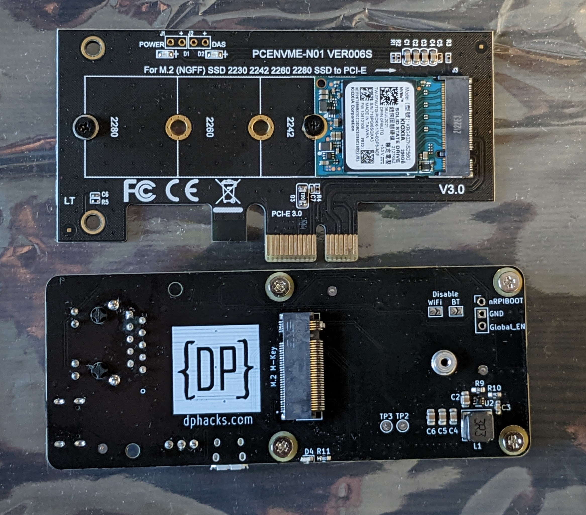
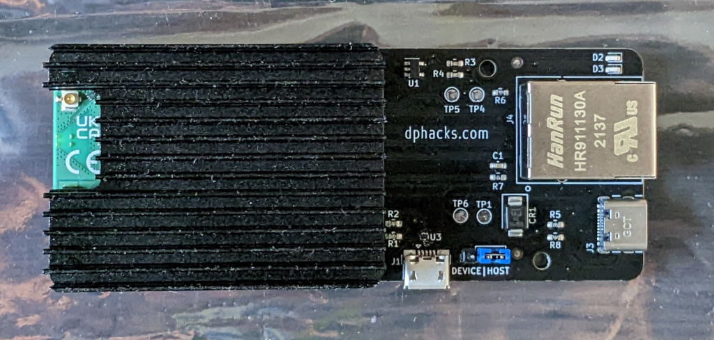

# dphacks CM4 Ether Board

Expansion board for the Raspberry Pi Compute Module 4 (CM4) that supports Ethernet, USB and PCIe/NVME SSD.

This board has kindly been provided for testing by `@makerbymistake` AKA `@rpilocator` at <https://dphacks.com/> (and IRL André). Thank you!

Board details.

* USB-C to power the board and CM4
* Micro-USB for data with jumper to select host/device mode.  In host mode, the board provides 5V to the USB device plugged in (as determined by the USB standard). Device mode is used to flash the eMMC module. (My CM4 is Lite => no eMMC so I cannot test this.)
* Both the power and data USB ports have basic protection against ESD.
* Shorting GND and Global_EN pins (with tweezers, etc) causes the CM4 to boot up when turned off or reboot if already running.
* M.2 M Key slot is powered by 3V (standard for SSDs). An M2 screw is proviced that fits into the post. Supported SSD sice is 2230.

## Pictures

Comparison to NVME adapter.



Ether Board with CM4 + heatsink installed.



## 2022-10-31 Plans

Happy Halloween!

I have a CM4 Lite with WiFi and 8GB RAM. I have been testing this with the official R-Pi expansion board (Pi-EB) including booting from NVME. For my Raspberry Pi 4B devices I prefer to use pure Debian but it will not boot the CM4 if anything is connected to the PCIe slot so it is a non-starter. I have an ARM64 R-Pi OS image installed on a 256GB Kioxia (PCIe X1) NVME SSD that I plan to test with.

The networking and NVME performance are the things I am most curious about. I may explore other areas such as USB boot and perhaps the connections for shutting down and booting the CM4.

## Baseline measurements

I plan to use `iperf3` and some common disk benchmarks to evaluate performance. Before swapping the CM4/heat sink and SSD to the CM4 Ether Board (CM4-EB) I'll complete the benchmarks on the Pi-EB. At this point I generally collect the time to complete the disk benchmarks as a first approximation of performance and will look at the detailed results if anything interesting comes up.

Before proceeding I upgraded all available packages and this provides the kernel

```text
hbarta@cm4nvme:~ $ uname -a
Linux cm4nvme 5.15.74-v8+ #1595 SMP PREEMPT Wed Oct 26 11:07:24 BST 2022 aarch64 GNU/Linux
hbarta@cm4nvme:~ $ 
```

I have Gnome installed and will disable that for this testing since the CM4-EB has no video output.

Before swapping boards the host name was changed to avoid SSH login issues (and my confusion.)

```text
sudo hostnamectl set-hostname cm4eb
```

## CM4-EB first boot

Uneventful. It came up, connected to my LAN via Ethernet and I was able to SSH in. Results of `ip addr` indicates that WiFi is working as well (though that resides entirely on the CM4.) At present the D2 (green) LED is flickering at about 1/s and the D3 (red) LED is on continuous. On to the benchmarks!

Quick reactions - The Ethernet and NVME performance seem pretty close to that on the official IO Board and this is both desired and expected.

## Benchmark comparison

### Network

|board|ping|iperf3||notes|
|---|---|---|---|---|
|| min/avg/max/mdev|Mbits/sec snd|recv||
|IO|0.146/0.191/0.227/0.024|||olive|
||0.214/0.270/0.551/0.094|924|919|oak|
|EB|0.164/0.204/0.278/0.038|||olive|
||0.213/0.265/0.489/0.075|904|899|oak|

### Disk

Crude results - just time to complete the benchmark. Details can be [viewed here](./data/benchmarks.md)

|board|fio||dd|
|---|---|---|---|
||time|rerun|time|
|IO|101|121|130|
|EB|101|124|128|

## Conclusion

One of the most important attributes of the CM4 is that it exposes a PCIe lane on the connectors. The official IO Board routes this to a PCIe x1 slot and the `@makerbymistake` board brings this out directly to an NVME slot. This is an ideal board to use for a headless file server where Ethernet and NVME provide all of the I/O is needed. Other functions that depend only on Ethernet such as Pi-Hole could also be supported at full Gigabit Ethernet speed and all with a footprint a fraction of the space required for the official board. I did not test USB but I understand that `@makerbymistake` has used it to run OctoPrint.
